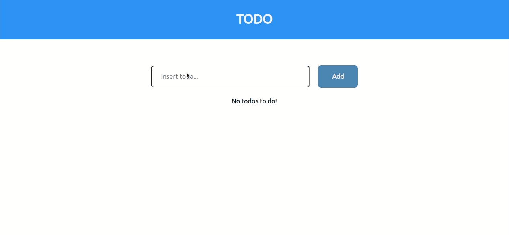

# :heavy_check_mark: &nbsp; TODO app

This project is a simple todo app for demonstrating the use of Redux in React app.

</img>

## Technologies

+ [React](https://pt-br.reactjs.org/)
+ [Redux](https://redux.js.org/)

## Usage

Run:

```
$ npm install
```

```
$ npm start
```

Open [http://localhost:3000](http://localhost:3000).

That's it!
